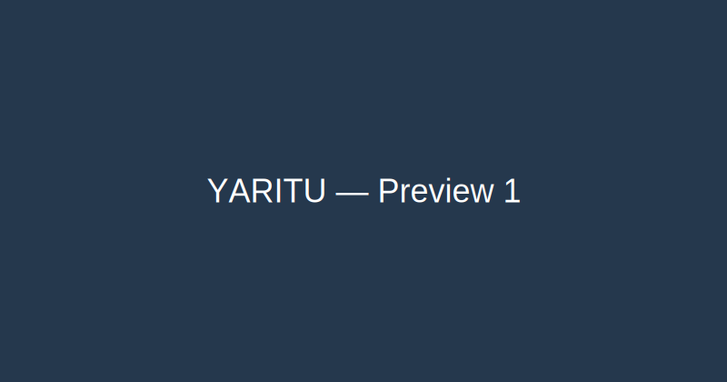

# Yaritu (Frontend)

This repository contains the frontend for the Yaritu project — a Next.js App Router application used to showcase and manage a curated clothing & jewellery rental catalogue.

Included in this folder:
- `app/` — Next.js App Router source (pages, API routes, components)
- `components/` — shared UI components used by the app
- `lib/` — small server & client utilities (db connect, s3 helpers, analytics)
- `models/` — Mongoose models used by API routes
- `public/` — static assets

## Local development

1. Install dependencies:

```bash
cd USER/frontend
npm install
```

2. Start the dev server:

```bash
npm run dev
```

3. Open the site:

Open http://localhost:3000 in your browser.

## Quick notes

- Environment: copy `.env.local.example` to `.env.local` and set `MONGODB_URI`, `NEXTAUTH_SECRET`, and any provider secrets.
- GA4: set `NEXT_PUBLIC_GA_ID` to enable Google Analytics (we added `app/lib/gtag.js` and script injection in `app/layout.js`).
- CDN caching: public read-only API endpoints export `revalidate = 60` and send `Cache-Control: s-maxage=60, stale-while-revalidate=300` headers.

## Screenshots / previews

Below are a couple of lightweight previews to help you get started. (SVGs are included in `docs/`.)




## Deploying

We deploy to Vercel in production. Make sure to set the following environment variables on Vercel:

- `MONGODB_URI`
- `NEXTAUTH_URL`
- `NEXTAUTH_SECRET`
- `NEXT_PUBLIC_BASE_URL` (e.g., https://your-vercel-app.vercel.app)
- `NEXT_PUBLIC_GA_ID` (optional)
- `AWS_ACCESS_KEY_ID`, `AWS_SECRET_ACCESS_KEY`, `AWS_REGION`, `AWS_S3_BUCKET_NAME` (if using S3)

Once env variables are configured, push to your `main` branch and Vercel will auto-deploy.

## Troubleshooting

- If a build fails on Vercel with a missing module, ensure all packages are listed in `package.json` and run `npm install` locally to replicate.
- If images appear blurry, check `app/lib/gtag.js` and Cloudinary transform helpers in `components/ProductCard.js`.

---

If you'd like a richer README (more screenshots, architecture diagram, or runbook), tell me which sections to expand and I'll add them.
